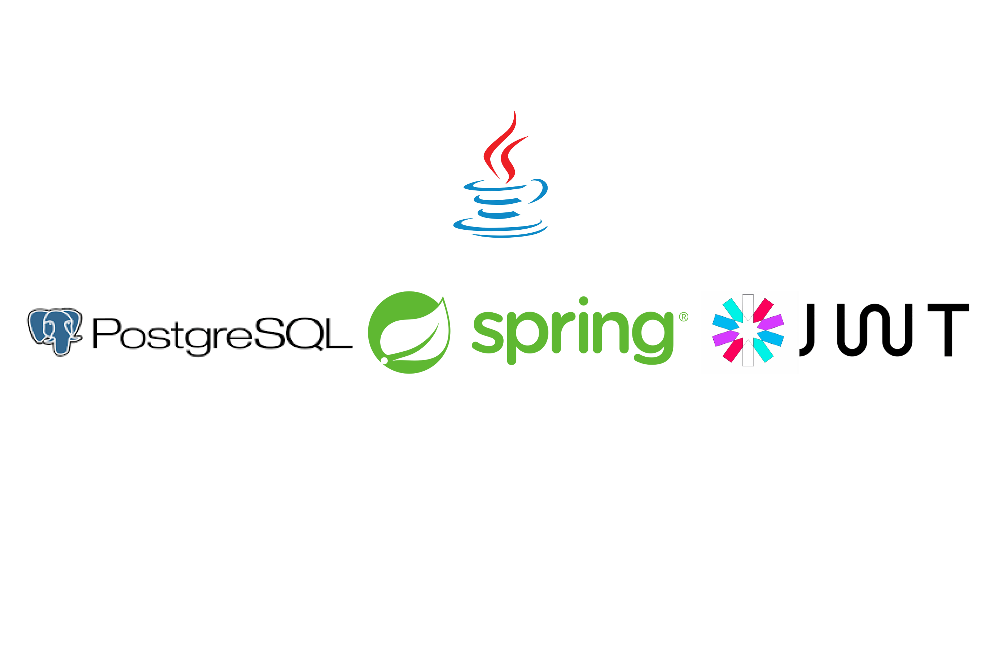

# Spring Boot "JWT Authentication" roles based



### Simple Restful CRUD API using Spring Boot, Postgresql, JPA and Hibernate, Spring Security.

## Steps to Setup

**1. Clone the application**

```bash
git clone https://github.com/majiedo/Spring-Boot-REST-API.git
```

**2. Spin up Postgresql database**

```bash
docker-compose up
```

**3. Create .env file in root directory**

```dotenv
SECRET_KEY=SuperSecretKey!
```

**4. Run the app using maven**

```bash
mvn spring-boot:run
```

The app will start running at <http://localhost:8080>

## Explore Rest APIs

The app defines following CRUD APIs.

### Auth

| Method | Url                | Description            | Sample Valid Request Body      | 
|--------|--------------------|------------------------|--------------------------------|
| POST   | /api/auth/register | Creating an account    | ( name, email, password ) JSON |
| POST   | /api/auth/login    | Login in to an account | ( email, password ) JSON       |

### Users

| Method | Url                 | Description                      | Sample Valid Request Body      |
|--------|---------------------|----------------------------------|--------------------------------|
| GET    | /api/users/         | Get All users                    |                                |
| Get    | /api/users/{userId} | Get user                         |                                |
| Post   | /api/users/{userId} | Create a user ( only for admin ) | ( name, email, password ) JSON |
| Patch  | /api/users/{userId} | Update a user ( only for admin ) | ( name, email, password ) JSON |
| Delete | /api/users/{userId} | Delete a user ( only for admin ) |                                |
